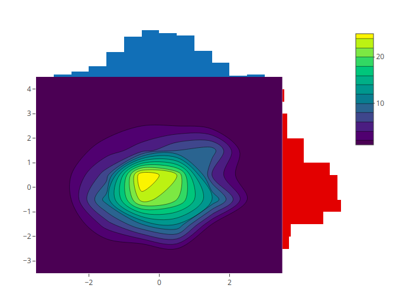
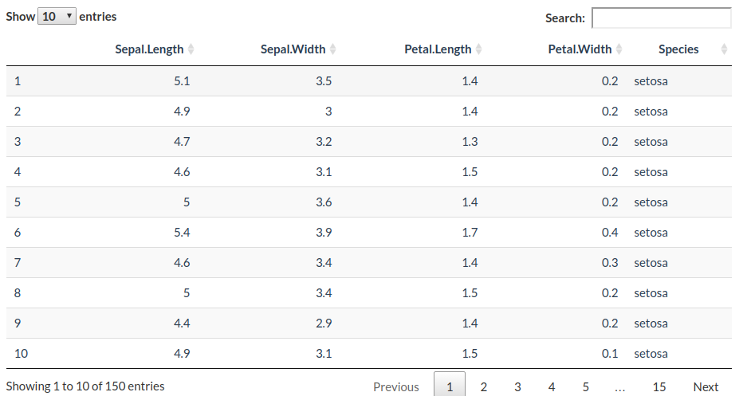
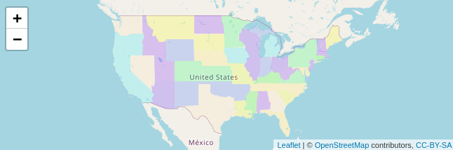
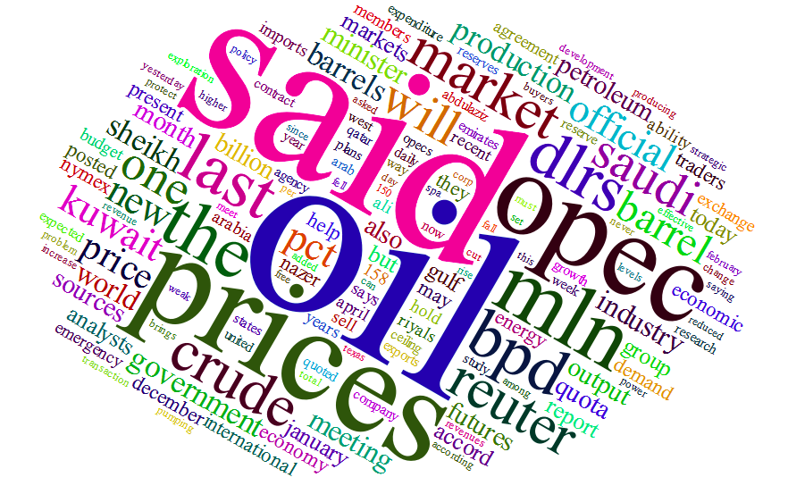
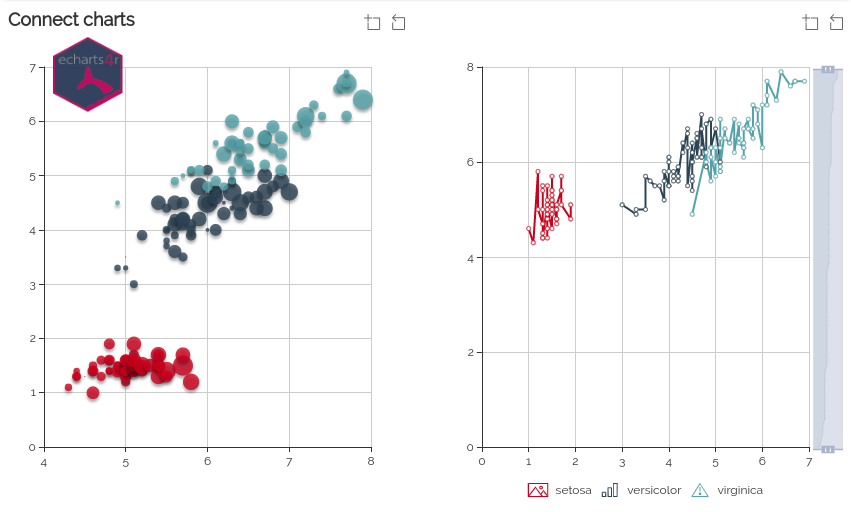
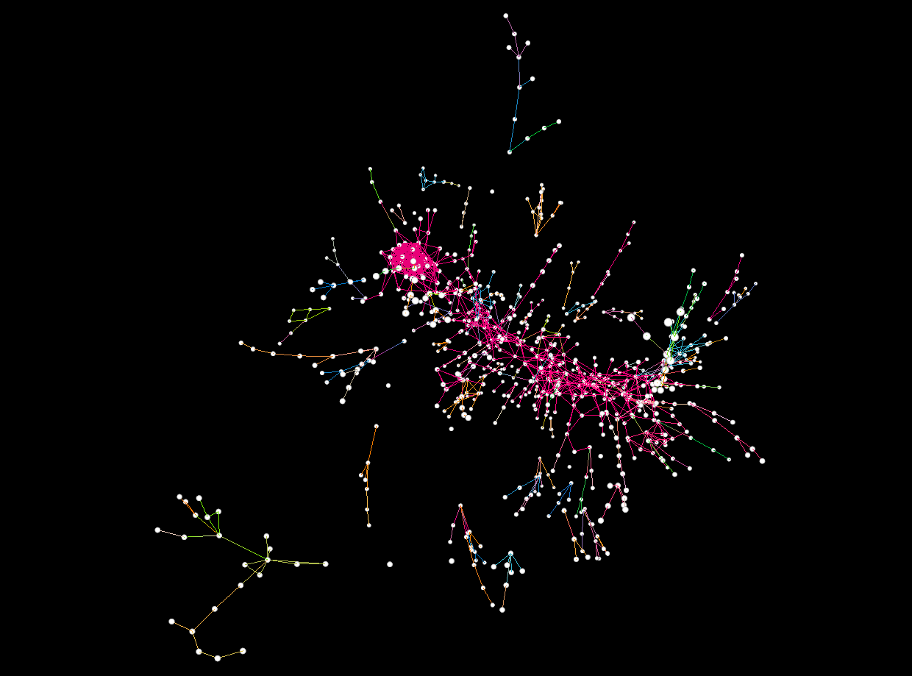
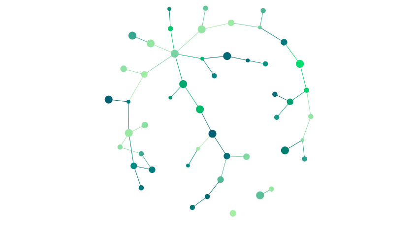

layout: true
  
<div class="my-header"></div>

<div class="my-footer"><span>How to build htmlwidgets workshop</span></div> 

---

.centerize[

  ## Plan

  Introduction to the basics (this) ~15 mins <br><br>
  Explore htmlwidgets hands-on ~45 mins <br><br>
  Build a widget for [typed.js](https://github.com/mattboldt/typed.js/) <br><br>
  Short break <br><br>
  Build a widget for [gio.js](https://giojs.org/)

]

---

.centerize[

  Resources

  ## htmlwidgets.john-coene.com

]

---

```{r, include = FALSE}
library(emo)
```

.centerize[

# What is "htmlwidgets"?

An R Package to wrap external JavaScript libraries that produce a visual output. 

]

---

## Examples

Visit [gallery.htmlwidgets.org](https://gallery.htmlwidgets.org/)

.pull-left[
  **plotly**
  <br/>
  

  **DT**
  <br/>
  
]

.pull-right[
  **leaflet**
  <br/>
  

  **wordcloud2**
  <br/>
  
]

---

## Shameless Promotions

A few of the htmlwidgets I have built.

.pull-left[
  **echarts4r**
  <br/>
  

  **grapher**
  <br/>
  
]

.pull-right[
  **sigmajs**
  <br/>
  

  **globe4r**
  <br/>
  
]

---

.centerize[

  ## Candidate Libraries

  Understand what is expected of us

]

---

.pull-left[
  ## Plotly

  - Import library
  - `<div>` to hold viz
  - `<script>` to generate 
    + references `<div>`
    + use JSON of options
]

.pull-right[

```html
<!DOCTYPE html>
<html xmlns="http://www.w3.org/1999/xhtml">

<head>
  <!-- Import library -->
  <script src="plotly-latest.min.js"></script>
</head>

<body>
  <!-- div to hold visualisation -->
  <div id="chart" style="width:600px;"></div>

  <!-- Script to create visualsiation -->
  <script>
    el = document.getElementById('chart');
    Plotly.newPlot(el, [{
      x: [1, 2, 3, 4, 5],
      y: [1, 2, 4, 8, 16] }]
    );
  </script>
</body>

</html>
```

]

---

.pull-left[
  ## Highchart.js

  - Import library
  - `<div>` to hold viz
  - `<script>` to generate 
    + references `<div>`
    + use JSON of options
]

.pull-right[

```html
<!DOCTYPE html>
<html xmlns="http://www.w3.org/1999/xhtml">

<head>
  <!-- Import library -->
  <script src="highcharts.js"></script>
</head>

<body>
  <!-- div to hold visualisation -->
  <div id="chart" style="width:100%;"></div>

  <!-- Script to create visualsiation -->
  <script>
    var myChart = Highcharts.chart('chart', {
        xAxis: {
            categories: ['Apples', 'Bananas', 'Oranges']
        },
        series: [{
            name: 'Jane',
            data: [1, 0, 4]
        }, {
            name: 'John',
            data: [5, 7, 3]
        }]
    });
  </script>
</body>

</html>
```

]

---

.pull-left[
  ## Chart.js

  - Import library
  - `<canvas>` to hold viz
  - `<script>` to generate
    + references `<canvas>`
    + use JSON of options
]

.pull-right[

```html
<!DOCTYPE html>
<html xmlns="http://www.w3.org/1999/xhtml">

<head>
  <!-- Import library -->
  <script src="Chart.min.js"></script>
</head>

<body>
  <!-- canvas to hold visualisation -->
  <canvas id="chart" width="400"></canvas>

  <!-- Script to create visualsiation -->
  <script>
    var el = document.getElementById('chart').getContext('2d');    
    var myChart = new Chart(el, {
      type: 'bar',
      data: {
        labels: ['Red', 'Blue', 'Yellow', 'Green'],
        datasets: [{
          label: '# of Votes',
          data: [12, 19, 3, 5]
        }]
      }
    });
  </script>
</body>

</html>
```

]

---

.centerize[

  ## How would this be done in R?

]

---

## Crate a static HTML file

```html
<html>
  <head></head>
  <body></body>
</html>
```

---

## Import dependencies

```html
<html>
  <head>
    <script src="relative/path/plotly.js"></script>
  </head>
  <body></body>
</html>
```

---

## Create Canvas

```html
<html>
  <head>
    <script src="relative/path/plotly.js"></script>
  </head>
  <body>
    <div id="an-identifier"></div>
  </body>
</html>
```

---

## Serialise R object

```html
<html>
  <head>
    <script src="relative/path/plotly.js"></script>
  </head>
  <body>
    <div id="an-identifier"></div>
    <script>[{Some: "JSON"}, data]</script>
  </body>
</html>
```

---

## Import custom functions

```html
<html>
  <head>
    <script src="relative/path/plotly.js"></script>
  </head>
  <body>
    <div id="an-identifier"></div>
    <script>[{Some: "JSON"}, data]</script>
    <script src="relative/path/custom.js"></script>
  </body>
</html>
```

---

.centerize[

## Finally, I need to manage this across Shiny and R markdown...

]

---

.centerize[

  ## It __should be__ complicated

]

---

.centerize[

  Thankfully, it isn't

  ## Meet __htmlwidgets__!

]

---

.centerize[

## Let's Start

First, create a package with `usethis` or the RStudio IDE.

```r
usethis::create_package('playground')
```

Then, from the root of the package, build the scaffolding for our visualisation.

```r
htmlwidgets::scaffoldWidget("playground")
```

]